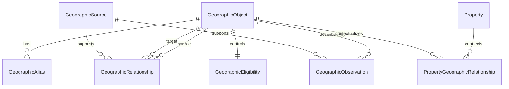

# PROJECT ATLAS - GIO 1.0 Wave 2 Canonical Core Model Charter

Program: `Geographic Intelligence System`

Architecture: `Geographic Intelligence Objects - GIO 1.0`

Wave: `Wave 2 - Canonical Core Model`

Charter date: July 25, 2026

Repository baseline: `632f106f412a43722afa2bb0fcc1517a21dd45b3`

Charter status: `DOCUMENTATION_ONLY_IMPLEMENTATION_READY`

Runtime implementation status: `NOT_AUTHORIZED`

## Executive Summary

Wave 2 defines the minimum durable Geographic Intelligence Object persistence and relationship architecture that can later be implemented additively without changing current production behavior.

The first implementation scope is limited to:

- `Municipality`
- `Neighborhood`
- `MarketArea`
- `ZipCode`
- `Subdivision`

`SchoolDistrict` remains part of the long-term GIO architecture but is deferred from the first persistence implementation pending a trust-specific education review.

Existing `Property` records must not be converted into GIO objects during the initial implementation. `Property` remains the production runtime anchor and connects to GIO through an additive relationship structure.

This charter is implementation-ready, but it does not authorize runtime code, Prisma schema changes, migrations, automatic data backfills, spatial resolution, public GIO pages, customer-facing modules, new external sources, vendor integrations, production writes, or AI conclusions.

## Current-State Constraints

Wave 2 must preserve:

- current `Property` runtime behavior
- existing city and neighborhood routes
- current slugs and URLs
- current search API behavior
- current map behavior
- current MLS ingestion
- current Typesense behavior
- existing static data until separately mapped
- existing public-page content
- existing trust boundaries

Repository evidence shows parallel geography representations in `Property` strings, Prisma `City` and `Neighborhood`, `lib/cities.ts`, `data/cities.ts`, `lib/neighborhoods.ts`, `data/neighborhoods.ts`, city market routes, neighborhood routes, search filters, Typesense fields, schema builders, and internal-link builders. Wave 2 must therefore define a canonical layer before any migration or data movement.

## Proposed Canonical Data Contracts

The preferred architecture is a generalized geographic object model with companion alias, relationship, source, observation/evidence, eligibility, and property-relationship contracts.

This keeps GIO additive, source-agnostic, and reusable while avoiding premature subtype-table sprawl.

## Field-Level Model Recommendations

### Geographic Object

Recommended fields:

| Field | Recommendation |
| --- | --- |
| `id` | Stable internal canonical ID, preferably `cuid` or UUID. |
| `objectType` | Registry-backed type code for initial values `MUNICIPALITY`, `NEIGHBORHOOD`, `MARKET_AREA`, `ZIP_CODE`, `SUBDIVISION`. |
| `canonicalName` | Normalized official or governed name. |
| `displayName` | Public/customer-friendly name. |
| `slug` | Stable canonical slug, unique by object type and parent/context. |
| `lifecycleStatus` | `PROPOSED`, `ACTIVE`, `LIMITED`, `DEPRECATED`, `MERGED`, `SUPERSEDED`, `ARCHIVED`. |
| `visibility` | `INTERNAL_ONLY`, `PUBLIC_ELIGIBLE`, `PUBLIC_VISIBLE`, `PRIVATE`, `ARCHIVED_REDIRECT`. |
| `parentObjectId` | Optional convenience parent for dominant hierarchy only. Must not replace relationship modeling. |
| `createdAt`, `updatedAt` | Standard timestamps. |
| `mergedIntoObjectId`, `supersedesObjectId` | Non-destructive merge and supersession tracking. |
| `identityStrategy` | Short governed note or enum such as `GOVERNMENT_NAME`, `POSTAL_CODE`, `EDITORIAL_MARKET_AREA`, `RECORDED_SUBDIVISION`, `MLS_DERIVED_CANDIDATE`. |

Constraints:

- `Property` is not a `GeographicObject` in the initial implementation.
- Object rows must not be physically deleted while routes, relationships, observations, or historical references depend on them.
- Slugs must be stable after publication; renames require alias and redirect strategy.

### Geographic Alias

Recommended fields:

| Field | Recommendation |
| --- | --- |
| `id` | Stable alias ID. |
| `objectId` | Required link to `GeographicObject`. |
| `aliasValue` | Alternative name, abbreviation, historic name, local name, or source-specific name. |
| `aliasType` | `ALTERNATIVE`, `ABBREVIATION`, `HISTORIC`, `LOCAL`, `SOURCE_SPECIFIC`, `MISSPELLING`, `FORMER_SLUG`. |
| `sourceId` | Optional source registry reference. |
| `language` | Optional BCP-47 language code. |
| `status` | `ACTIVE`, `DEPRECATED`, `CONFLICTED`, `ARCHIVED`. |
| `createdAt`, `updatedAt` | Standard timestamps. |

Alias resolution must preserve ambiguity. If one alias maps to multiple active objects, the runtime should surface ambiguity internally rather than silently selecting a result.

### Geographic Relationship

Recommended fields:

| Field | Recommendation |
| --- | --- |
| `id` | Stable relationship ID. |
| `sourceObjectId` | Required source object. |
| `targetObjectId` | Required target object. |
| `relationshipType` | Registry-backed type code. |
| `directionality` | `DIRECTED`, `SYMMETRIC`, or `DERIVED`. |
| `confidence` | `AUTHORITATIVE`, `HIGH_CONFIDENCE`, `CORROBORATED`, `DERIVED`, `EDITORIAL`, `PROVISIONAL`, `DISPUTED`, `UNKNOWN`. |
| `effectiveDate`, `expirationDate` | Optional date bounds. |
| `sourceId` | Optional `GeographicSource` reference. |
| `evidenceKey` | Optional evidence/observation reference. |
| `assignmentMethod` | `AUTHORITATIVE_SOURCE`, `MANUAL_REVIEW`, `STRING_MATCH`, `ALIAS_MATCH`, `SPATIAL_DERIVED`, `MLS_DERIVED`, `EDITORIAL`. |
| `lifecycleStatus` | `PROPOSED`, `ACTIVE`, `LIMITED`, `DEPRECATED`, `SUPERSEDED`, `ARCHIVED`. |
| `publicVisibility` | Independent public visibility control. |

Initial relationship types:

- `PART_OF`
- `CONTAINS`
- `LOCATED_IN`
- `WITHIN_ZIP_CODE`
- `INCLUDED_IN_MARKET_AREA`
- `OVERLAPS`
- `RELATED_TO`
- `OBSERVED_BY`

Deduplication:

- Active directed relationships should be unique by `sourceObjectId`, `targetObjectId`, `relationshipType`, `effectiveDate`, and `assignmentMethod` unless a conflict group explicitly permits competing claims.

### Geographic Source Registry

Recommended fields:

| Field | Recommendation |
| --- | --- |
| `id` | Stable source ID. |
| `sourceCode` | Human-readable stable code. |
| `sourceName` | Source name. |
| `sourceClass` | `AUTHORITATIVE_GOVERNMENT`, `AUTHORITATIVE_INDUSTRY`, `LICENSED_COMMERCIAL`, `FIRST_PARTY_ENTERPRISE`, `SECONDARY_PUBLIC`, `USER_SUBMITTED`, `PARTNER`. |
| `authorityLevel` | `PRIMARY`, `PERMITTED_FALLBACK`, `SUPPLEMENTAL`, `EDITORIAL`, `UNKNOWN`. |
| `accessMethod` | `MANUAL`, `API`, `FILE_IMPORT`, `PUBLIC_DOWNLOAD`, `INTERNAL_STATIC`, `NOT_CONFIGURED`. |
| `licenseRestrictions` | Text or coded restriction summary. |
| `geographicCoverage` | Jurisdiction or object coverage notes. |
| `defaultUpdateCadence` | `REAL_TIME`, `DAILY`, `WEEKLY`, `MONTHLY`, `QUARTERLY`, `ANNUAL`, `AD_HOC`, `UNKNOWN`. |
| `publicDisplayRestrictions` | Required display and attribution controls. |
| `operationalHealthState` | `READY`, `WATCH`, `BLOCKED`, `NOT_CONFIGURED`, `RETIRED`. |

Source abstraction must precede additional vendor integration. Source records describe roles and constraints, not a mandate to integrate.

### Geographic Observation Or Evidence

Recommended fields:

| Field | Recommendation |
| --- | --- |
| `id` | Stable observation/evidence ID. |
| `objectId` | Optional GIO object reference. |
| `relationshipId` | Optional relationship reference. |
| `observationType` | Registry-backed observation type. |
| `valueKind` | `STRING`, `NUMBER`, `BOOLEAN`, `DATE`, `JSON`, `URL`, `ENUM`, `MEASUREMENT`, `TEXT`. |
| `value` | JSON value container. |
| `sourceId` | Required for material facts. |
| `effectiveDate`, `retrievedDate`, `lastVerifiedDate` | Trust timing fields. |
| `freshness` | `CURRENT`, `REVIEW_DUE`, `STALE`, `HISTORICAL`, `UNKNOWN`. |
| `confidence` | Same confidence vocabulary as relationships. |
| `derivationMethod` | `DIRECT_SOURCE`, `NORMALIZED`, `CALCULATED`, `EDITORIAL`, `SPATIAL_DERIVED`, `IMPORT`, `MANUAL_REVIEW`. |
| `conflictGroupKey` | Groups competing observations without deleting disagreement. |
| `publicVisibility` | Controls if value can appear publicly. |
| `reviewStatus` | `UNREVIEWED`, `REVIEWED`, `NEEDS_REVIEW`, `REJECTED`, `ARCHIVED`. |

Observation/evidence should hold extensible intelligence so the core object row remains stable and sparse.

### Geographic Eligibility

Eligibility must remain independent and not collapse to one public/private flag.

Recommended controls:

- `internalUseEligible`
- `searchEligible`
- `mapEligible`
- `publicPageEligible`
- `indexingEligible`
- `propertyEnrichmentEligible`
- `marketAnalyticsEligible`
- `eligibilityReviewStatus`
- `eligibilityReason`

Eligibility changes should be reviewable and reversible.

### Property Geographic Relationship

Recommended fields:

| Field | Recommendation |
| --- | --- |
| `id` | Stable relationship ID. |
| `propertyId` | Existing `Property.id`; no conversion into GIO. |
| `objectId` | Target `GeographicObject`. |
| `relationshipType` | Initial values: `LOCATED_IN`, `WITHIN_ZIP_CODE`, `IN_SUBDIVISION`, `INCLUDED_IN_MARKET_AREA`, `RELATED_TO`. |
| `sourceId` | Source registry reference. |
| `confidence` | Confidence vocabulary. |
| `effectiveDate`, `expirationDate` | Date bounds. |
| `assignmentMethod` | `EXISTING_PROPERTY_STRING`, `MANUAL_REVIEW`, `ALIAS_MATCH`, `SPATIAL_DERIVED`, `MLS_DERIVED`, `AUTHORITATIVE_SOURCE`. |
| `status` | `PROPOSED`, `ACTIVE`, `LIMITED`, `DEPRECATED`, `DISPUTED`, `ARCHIVED`. |
| `supportsCurrentStringField` | Names the existing field the relationship came from, such as `city`, `zip`, `neighborhood`, or `subdivision`. |
| `dedupeKey` | Deterministic key for idempotent assignment. |

Compatibility strategy:

- Keep `Property.city`, `Property.zip`, `Property.neighborhood`, `Property.subdivision`, and `Property.schoolDistrict` unchanged.
- Add GIO relationships as parallel evidence.
- Do not change search, maps, property pages, MLS ingestion, Typesense documents, or public routing during the first implementation.

## Enum Or Registry Recommendations

Use registry-backed object and relationship types in persistence, with application-level constants for initial type safety.

Rationale:

- Enum-only types make later geographic expansion harder and require migrations for every new class.
- Registry-only types can become too loose without code-level validation.
- The recommended hybrid gives governance flexibility while retaining testable allowed values for Wave 3.

Initial object-type registry values:

- `MUNICIPALITY`
- `NEIGHBORHOOD`
- `MARKET_AREA`
- `ZIP_CODE`
- `SUBDIVISION`

Deferred registry values may be documented but not activated in Wave 3.

## Required Architectural Decisions

| Question | Recommendation |
| --- | --- |
| One generalized object table versus subtype tables | Use one generalized object table for Wave 3. Defer subtype tables until actual subtype complexity requires them. |
| Enum-based versus registry-based object types | Use registry-backed types with code constants and safety checks. |
| Parent-child hierarchy versus relationship containment | Store optional parent for dominant hierarchy, but treat relationships as authoritative for containment and overlap. |
| PostgreSQL geometry now versus deferred geometry | Defer geometry columns in Wave 3 unless a source-approved geometry package is also authorized. |
| PostGIS field strategy | Do not require PostGIS in first persistence wave; reserve nullable geometry fields or a future geometry companion table in the design. |
| Canonical slug uniqueness | Unique by object type plus parent/context; preserve global redirects/aliases for retired slugs. |
| Object merge and supersession | Never silently delete; use `mergedIntoObjectId`, `supersedesObjectId`, lifecycle, aliases, and redirects. |
| Alias resolution | Allow many aliases per object and preserve ambiguous aliases rather than silent selection. |
| Observation value storage | Store observations as typed JSON with `valueKind`; add typed derived columns only after proven query needs. |
| Source and evidence deduplication | Use `sourceCode`, source record identifiers, observation type, effective date, and conflict group keys. |
| Conflict preservation | Preserve competing observations/relationships with conflict groups and review status. |
| Historical effective dating | Support `effectiveDate` and `expirationDate` on relationships and observations. |
| Eligibility storage | Use an eligibility companion table or explicit eligibility fields; do not infer from lifecycle alone. |
| Referential behavior on deletion or retirement | Use restrictive references and lifecycle retirement; avoid cascading deletion of history. |
| Idempotent ingestion | Require deterministic dedupe keys for source, object, relationship, observation, and property assignment upserts. |
| Migration compatibility | Map current city/neighborhood/market/static data in dry-run report mode before writes. |
| Repository-governance or EIA reuse | Reuse concepts and vocabulary; do not directly overload Repository or EIA tables for public GIO persistence without a separate architecture decision. |
| Testing and safety checks | Add static safety checks for scope, no runtime wiring, no public route changes, idempotency, and preserved existing fields. |
| Rollback and reversibility | Wave 3 must be additive and reversible through migration rollback and disabling any read adapters. |
| Build/workers/deployment impact | Prisma generation/build may be affected only once schema work is separately authorized; workers and production runtime should remain unchanged. |

## Uniqueness And Indexing Strategy

Recommended unique constraints for Wave 3 implementation:

- Geographic object: unique `objectType + parentObjectId + slug` for active objects.
- Alias: unique `objectId + normalizedAliasValue + aliasType` for active aliases.
- Relationship: unique active relationship by source, target, type, effective date, and assignment method.
- Source: unique `sourceCode`.
- Observation: deterministic uniqueness by object/relationship, observation type, source, effective date, source record ID, and conflict group.
- Property relationship: unique active relationship by property, target object, relationship type, assignment method, and effective date.

Recommended indexes:

- object type and lifecycle
- slug and parent
- alias normalized value
- relationship source and target
- source code/class/health
- observation object/type/source/freshness
- property relationship property/object/type/status
- eligibility flags for internal review screens

## Source And Trust Model

Every material GIO fact must either reference a source registry record or be marked as first-party editorial context.

Trust fields should use the existing EIA-inspired vocabulary where appropriate:

- confidence
- freshness
- privacy/public visibility
- sensitivity
- retention or retirement posture
- created/retrieved/verified timestamps
- supersession and correction links

Public presentation must translate trust states into customer-safe language, not expose operational internals.

## Compatibility Strategy

Wave 3 must be additive:

- No current field is removed.
- No current route changes.
- No current slug changes.
- No current search behavior changes.
- No current map behavior changes.
- No current MLS ingestion behavior changes.
- No current Typesense schema/index behavior changes.
- No current public content is generated or rewritten.

Initial data mapping should produce a report from existing `Property` strings and static data before any write path is authorized.

## Migration And Backfill Strategy

Wave 3, if authorized later, should proceed in this order:

1. Add additive persistence only.
2. Generate Prisma client and validate build/type safety.
3. Add static no-runtime-change safety checks.
4. Produce dry-run mapping reports from current city, neighborhood, market, ZIP, and subdivision strings.
5. Review duplicates, ambiguous aliases, and unsupported candidates.
6. Only after separate authorization, seed a bounded canonical object set.
7. Only after another authorization, create property-geographic relationships in bounded batches.

No automatic data backfill is authorized by this charter.

## Safety Boundaries

Not authorized:

- runtime code
- Prisma schema changes
- migrations
- automatic data backfills
- spatial resolution
- public GIO pages
- customer-facing modules
- new external sources
- vendor integrations
- production writes
- AI conclusions

Trust constraints:

- `MarketArea` must remain distinct from `Municipality`.
- `SchoolDistrict`, school, and attendance-boundary work is deferred.
- Environmental, safety, insurance, legal, title, valuation, affordability, investment, and school-quality conclusions remain prohibited.

## Validation Plan

For this charter:

- `git diff --check`
- direct document review
- `git status --short --branch`
- `git rev-parse HEAD`
- `git rev-parse origin/main`

For a future Wave 3 implementation package:

- migration review
- Prisma generate validation
- typecheck
- lint
- build if compiled/runtime files change
- GIO safety check
- no-runtime-change static check
- current search/map/property route preservation checks
- dry-run mapping report review
- rollback plan review

## Testing Requirements

Future Wave 3 tests should cover:

- object type registry constraints
- slug normalization and uniqueness
- alias ambiguity preservation
- relationship idempotency and deduplication
- source registry uniqueness and health state
- observation conflict grouping
- eligibility independence
- property relationship compatibility with existing string fields
- no route/search/map/MLS/Typesense behavior changes

## Rollback Strategy

Documentation-only Wave 2 is reversible by reverting this file.

Future Wave 3 must include:

- additive migration rollback path
- seed/backfill dry-run before writes
- bounded write batches only after authorization
- ability to disable read adapters without touching current runtime
- no destructive cleanup until GIO data is proven stable

## Risks And Open Decisions

Risks:

- Duplicate geography sources can create conflicting canonical records.
- Static neighborhood and market values lack source/freshness metadata.
- Boundary and subdivision identity are ambiguous without approved sources.
- Public page expansion can create thin or duplicative SEO surfaces.
- School and demographic data can create fair-housing and trust risks.
- Directly reusing Repository/EIA tables could couple internal governance to public geography.

Open decisions:

- Final persistence location for GIO tables.
- Whether geometry uses deferred columns or a companion geometry table.
- First approved authoritative source set for municipalities, ZIP codes, subdivisions, and market areas.
- Exact governance process for object merge/supersession.
- Whether Wave 3 includes seed data, or persistence only.

## Proposed Wave 3 Implementation Scope

Recommended Wave 3 scope, if separately authorized:

- Additive persistence foundation only.
- Registry-backed object types for `Municipality`, `Neighborhood`, `MarketArea`, `ZipCode`, and `Subdivision`.
- Geographic object, alias, relationship, source, observation/evidence, eligibility, and property-geographic relationship persistence contracts.
- No customer-facing reads.
- No production data backfill.
- No search/map/property page integration.
- Static safety checks and dry-run mapping script may be included only if explicitly authorized in the Wave 3 package.

## Explicit Wave 3 Exclusions

Wave 3 should exclude:

- `SchoolDistrict` persistence
- school attendance boundaries
- parcel/title/HOA/covenant modeling
- environmental hazard zones
- public GIO pages
- public map layers
- public search changes
- Typesense GIO index
- vendor integrations
- automated source imports
- production backfills
- AI-generated conclusions

## Acceptance Criteria

Wave 2 charter acceptance requires:

- This document exists in the PROJECT ATLAS executive library.
- The initial object-type scope is limited to `Municipality`, `Neighborhood`, `MarketArea`, `ZipCode`, and `Subdivision`.
- `Property` remains the runtime anchor and is not converted into a GIO object.
- `SchoolDistrict` is explicitly deferred.
- Source registry and trust metadata precede vendor/source expansion.
- Eligibility controls remain independent.
- Current runtime behavior remains untouched.
- Validation commands pass.

## Recommended Authorization Decision

Authorize Wave 3 only as an additive persistence-foundation package after review of this charter.

Do not authorize runtime integration, public presentation, vendor integration, spatial resolution, automatic backfill, or customer-facing behavior in Wave 3.
